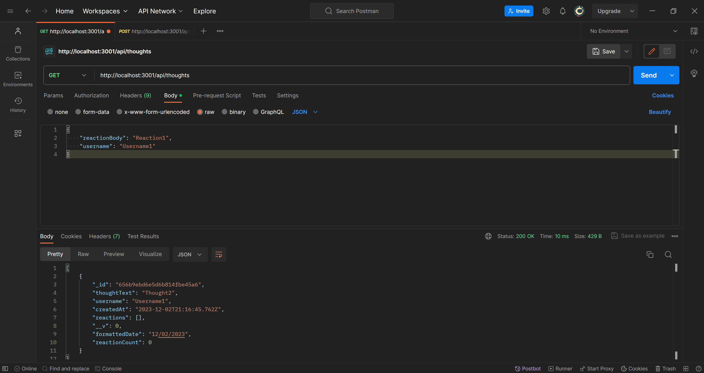
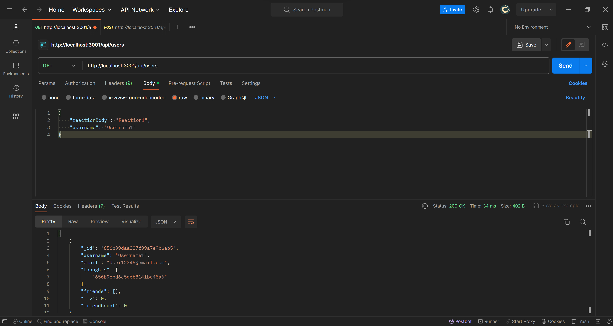

# Social Network API

## Description

This is a simple backend application that works similarly to a social media app that users can share thoughts, add friends and react to friend's posts

## Mock-Up

The following images shows the application's appearance and functionality: 

Images taken using Postman

## Video  Link

## Built With

-Node.js

-Express.js

-Mongoose

-MongoDB